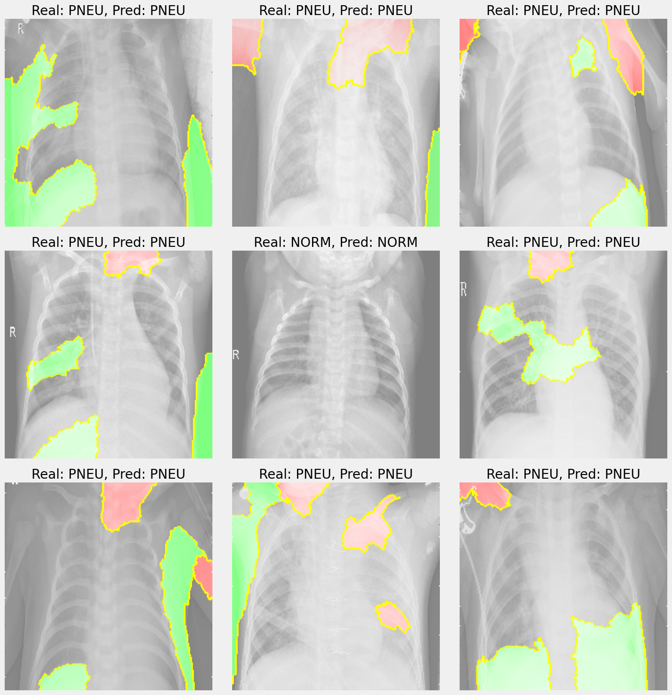
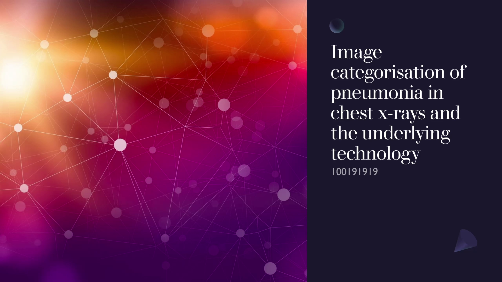

  

# About
I made these notebooks as part of the data mining and foundations of AI module while I was at university. This module consisted of two assignments, correlating a CSV of data to diabetes, and refining and image model to identify images of phenomena. 

 
I achieved an overall grade of 80% for the module.

## Powerpoint overview of assignment 2

